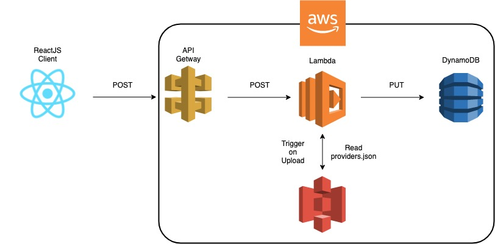

This project was bootstrapped with [Create React App](https://github.com/facebook/create-react-app).

## Provider Registration From - ReactJS

Small app created with ReactJS ane AWS. The client side has a form where the user can enter their provider's information, then the data will be sent to AWS to be stored in DynamoDB.

## Deployed App

[View deployed app](https://provider-form.firebaseapp.com/)

### Tech Stack

-ReactJS 
-AWS API Getway 
-AWS Lambda 
-AWS IAM (security and roles) 
-AWS S3 
-AWS DynamoDB 

### Workflow

### View the Data uploaded into DynamoDB

[Click here to view the data in the DynamoDB table](https://p2pqluc1s5.execute-api.us-east-1.amazonaws.com/providers-api/providers)

### `npm start`

Runs the app in the development mode. 
Open [http://localhost:3000](http://localhost:3000) to view it in the browser.

The page will reload if you make edits. 
You will also see any lint errors in the console.

### `npm run build`

Builds the app for production to the `build` folder. 
It correctly bundles React in production mode and optimizes the build for the best performance.

The build is minified and the filenames include the hashes. 
Your app is ready to be deployed!

See the section about [deployment](https://facebook.github.io/create-react-app/docs/deployment) for more information.
